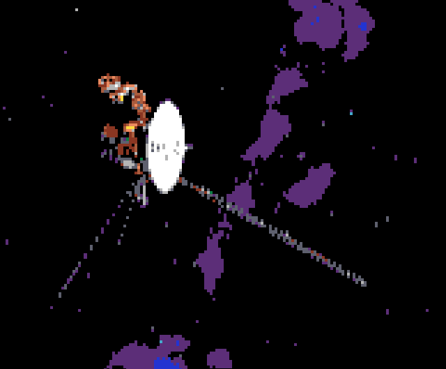

<h2 align="center"> Hi there  </h2>

  

  
    
  
  
  

 
 
  

---------

---------

## 🪐 Introduction

<h3>🌌 All You Need To Know 🌌</h3>

 
- Bachelor's in <b>Computer Science</b>.
 
- Working on AI, ML, aerospace engineering and robotics. 
 
- Esolang programming languages, training AI models, NLP & NER, mock-up designing and cipher decoding.
 
 
 
 

---------
## 🪐 My Medium Articles

---------

<h3>
 
  
🛸 Github Stats

  

       
     

</h3>

---------

      

