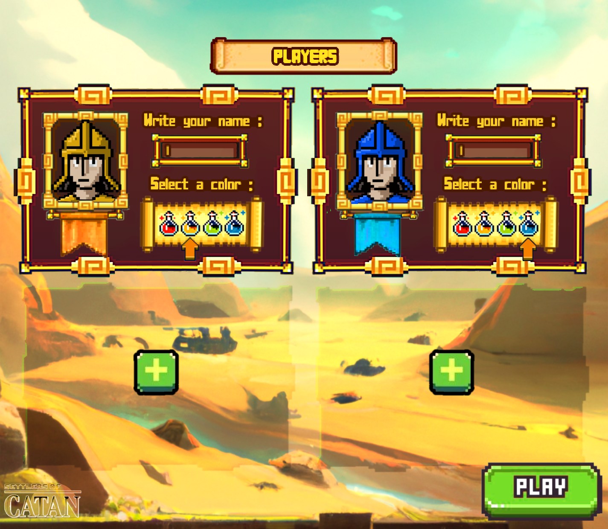

<h1 align="center">Hi there 👽 </h1>

  

---------

---------

## 🪐 Introduction

<h3>🌌 All You Need To Know 🌌</h3>

>>> Bachelor's in <b>Computer Science</b>. Enthusiast in the fields of spacecrafts, aerospace engineering, robotics, and contemporary art. Alongside programming and graphic design, in my spare time, I love researching on how satellites work. Additionally, I have a soft spot for Esolang programming languages, mock-up designing, ciphers, and a specific comic book franchise centered around transforming alien robots. Among my favorite activities are front-end development, visiting art museums <i>(which can be seen on my personal site)</i> and creating engaging presentations.

---------

## 🏆 Personal Development and Achievements

<h3>🌌 Lorem ipsum dolor 🌌</h3>

Lorem ipsum dolor sit amet, consectetur adipisicing elit, sed do eiusmod tempor incididunt ut labore et dolore magna aliqua. Ut enim ad minim veniam, quis nostrud exercitation ullamco laboris nisi ut aliquip ex ea commodo consequat. Duis aute irure dolor in reprehenderit in voluptate velit esse cillum dolore eu fugiat nulla pariatur. Excepteur sint occaecat cupidatat non proident, sunt in culpa qui officia deserunt mollit anim id est laborum. Lorem ipsum dolor sit amet, consectetur adipisicing elit, sed do eiusmod tempor incididunt ut labore et dolore magna aliqua. 

---------

## 🌌 Contributions and Collaborations

<!-- 

  
  
  

-->

<h3>🌌 So What Have I Done Till Now? 🌌</h3>

>>> As the lead <b> Graphics and Sound Designer </b> for [Settlers of Catan](https://github.com/Lovelaced-Team/Settlers-of-catan), I'm responsible for creating captivating visuals and immersive scenery that enhance the gaming experience. From designing detailed mock-ups, game buttons, materials and player cards to crafting soundtracks and ambient sounds, my focus is on making every playthrough visually stimulating and audibly engaging. I'm thrilled to be part of this exciting project and contribute to the world of gaming through my passion for game design, graphics, and sound. 🚀🌌

-------------------

      

          
<h3>🚀 List Of Projects I've Contributed To</h3>

          
      

          
<h3>👽 List Of Projects I've Created</h3>

---------------
<!--
## ⌛ Timeline

| | Project | Time | Role |
|-------------|-----|---|---------------------|
|   | Settlers of Catan | 2022-2023 | Lead Graphic and Sound Designer, Code Designer |
|  | Teams | 2023- | Lead Programmer and Designer | 

-->

 
  
<h3>🛸 Github Stat Stuff</h3>

  

    
  

   

  

    
  

---------

      
  

