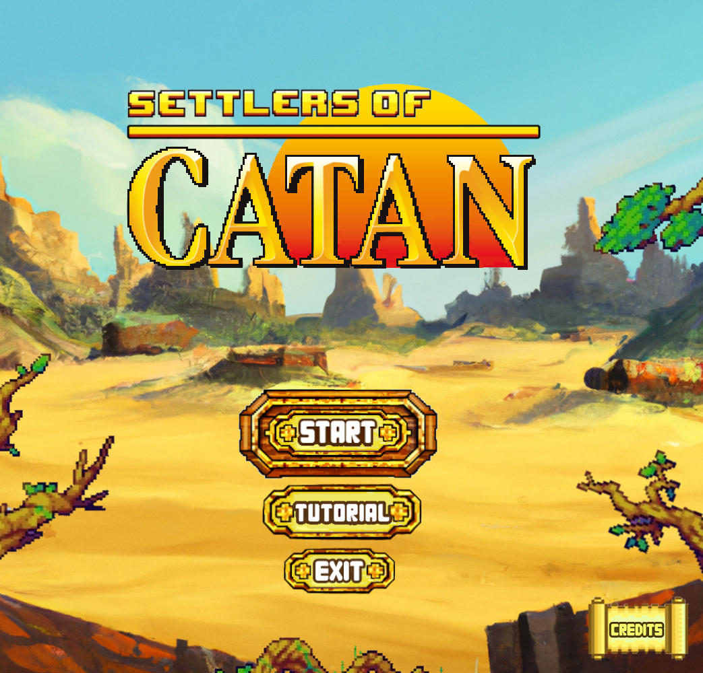

<h2 align="center"> ★ ⫷  Hi there 👽 ⫸★</h2>

<h2 align="center">
  
    
  
</h2>

---------

---------

## 🪐 Introduction

<h3>🌌 All You Need To Know 🌌</h3>

Bachelor's in <b>Computer Science</b>. Enthusiast in the fields of spacecrafts, aerospace engineering, robotics, and contemporary art. Alongside programming and graphic design, in my spare time, I love researching on how satellites work. Additionally, I have a soft spot for Esolang programming languages, cheap action movies, mock-up designing, ciphers, the Library of Babel and a specific comic book franchise centered around transforming alien robots. Among my favorite activities are front-end development, visiting art museums <i>(which can be seen on my personal site)</i> and creating engaging presentations.

---------

## 🏆 Personal Development and Achievements

<h3>🌌 What Else Than Uni? 🌌</h3>

Throughout my academic journey, I have embraced several opportunities for personal and professional growth. Some of these accomplishments include:
- Winner of [Tech4Good, Huawei Seeds for the Future at Athens (2023)](https://www.protothema.gr/technology/article/1442844/i-huawei-giortazei-tin-epituhi-oloklirosi-tou-ekpaideutikou-programmatos-seeds-for-the-future-2023/) with start-up company Expeye.
- Top performer in [Microsoft Dynamics Academy](https://drive.google.com/file/d/1x_wW41mJcgmyY-ASwzRCw14ixJc-ZGsr/view) and [Huawei Seeds for the Future (2023)](https://drive.google.com/file/d/1X5RlbpPs5QyHgyfUGE0C7swEYxaQMb0q/view).
- Had the honor of representing [HERON Robotics](https://github.com/Heron-Robotics) (2023) through presentations while also imparting knowledge to academic audiences about GitHub and Git.
- External participant in COMETECH <!-- [COMETECH](https://cometechproject.eu/wp-content/uploads/2021/10/COMETECH-Final-Event_Minutes.pdf) --> Project (September 2021, Thessaloniki).
- Accumulated a total of 16 certifications -and counting!- in IT and Digital Marketing from companies such as LinkedIn, Google, and Microsoft.
- Had the privilege of presenting my research paper on e-commerce, at the 18th Forum for Sustainable Development, Economics, and Trade (FSDET) hosted by Athens University of Economics & Business.
- And recently got published in the International Research Journal of Economics and Management Studies ([IRJEMS](https://irjems.org)).

---------

## 🌌 Contributions and Collaborations

<!-- 

  
  
  

-->

<h3>🌌 So What Else Have I Done Till Now? 🌌</h3>

As the lead <b> Graphics and Sound Designer </b> for [Settlers of Catan](https://github.com/Lovelaced-Team/Settlers-of-catan), I'm responsible for creating the logo, detailed mock-ups, game buttons and materials to crafting soundtracks and ambient sounds, my focus is on making every playthrough visually stimulating and audibly engaging. 
 Furthermore, as the lead <b> Graphics and Code Designer </b> for Expeye, I ensure that I bring the concept of sustainable cooking to life, revolutionizing the way individuals reduce food wastage. 🚀🌌

<!--
<table border="0">
  <tr>
    <td>
      

          
<h3>🚀 List Of Projects I've Contributed To</h3>

      

    <td>
          

            
<h3>👽 List Of Projects I've Created</h3>

          

    </td>
  </tr>
</table>
-->

 

---------------
## ⌛ Timeline

| | Project | Time | Role |
|-------------|-----|---|---------------------|
|   | | 2022-2023 | Lead Graphic and Sound Designer, Code Designer |
|  |  | 2023- | Programmer and Lead Designer | 

-------------

 
  
<h3>🛸 Github Stat Stuff</h3>

  

    
  

   

  

    
  

---------

      
  

